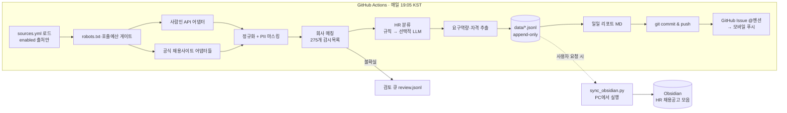

# HR 채용공고 트래커 기획서 (HR-Recruitment-Notice-Track)

작성일: 2026-10-02 KST (같은 날 개정: 13·14절 추가) · 상태: 기획 완료, 구현 전 · 원본 블루프린트: `HR_Recruitment_Watch_Blueprint.md`(2026-10-02)
구현 도구: Claude Code(주력) · Codex(교차 리뷰) · Cursor

---

## 0. 한 줄 요약

**2025년 매출 1,000억원 이상 기업(초기 275개)이 오늘 올린 HR 채용공고를 매일 19:05 KST에 자동 수집해 비공개 GitHub 레포에 쌓고, GitHub 알림으로 알려주며, 원할 때 Obsidian `HR 채용공고 모음` 폴더로 내려받아 채용 트렌드(워딩·요구역량·필수자격)를 분석한다.**

수집은 공식 API와 기업 공식 채용사이트만 사용한다. 블라인드·리멤버에는 접속하지 않는다. 로그인이 필요한 경로도 쓰지 않는다.

---

## 1. 목적과 사용자

| 용도 | 무엇을 얻나 | 빈도 |
|---|---|---|
| 개인(이직·커리어) | 관심 기업의 HR 공고 신규 알림, 마감일, 관심·지원 상태 관리 | 매일 |
| 업무(HR 실무) | 대기업 HR 채용 트렌드: 어떤 분야(TA/C&B/HRBP…)를 뽑는지, 공고 워딩, 요구역량·필수자격·우대사항 변화 | 주간·월간 |

사용자는 1명(준호님)이다. 외부 공개·판매는 범위 밖이다. 공개하려면 10절의 법무 확인이 먼저 필요하다.

---

## 2. 블루프린트 대비 변경점

| 항목 | 블루프린트(10-02) | 이번 기획 | 이유 |
|---|---|---|---|
| 실행 위치 | Windows PC + 작업 스케줄러 | **GitHub Actions(클라우드)**. PC 실행은 대체 경로 | PC가 꺼져 있어도 매일 수집 |
| 실행 시각 | 09:00·18:00 | **매일 19:05 KST 1회**(cron `5 10 * * *` UTC) | 사용자 요구는 19:00. 정시 혼잡을 피해 5분 늦춤 |
| 저장소 | 로컬 SQLite | **Git 레포의 JSONL 파일**(+ 분석 시 DuckDB) | 레포 보관 요구. diff·이력이 Git에 남음 |
| 화면 | React 대시보드 | **1차는 Obsidian Bases 표**. React는 후속 | 수집·분류 품질을 먼저 확보 |
| 알림 | 앱 내부 목록 | **GitHub Issue(@멘션) → GitHub 모바일 푸시**. ntfy는 선택 | "github push 알림" 요구 |
| 분석 | HR 공고 확인 | + **요구역량·필수자격·워딩 트렌드 리포트** | 업무 목적 추가 |

블루프린트에서 그대로 유지하는 것: 275개 감시 목록과 법인 식별 원칙, HR 분류 체계(10개 분야), 발견 상태와 수집 상태의 분리, `FOUND / NOT_FOUND_IN_CHECKED_SCOPE / UNDETERMINED / REVIEW`, 블루프린트 10절 검증 사례 15개.

---

## 3. 수집 경로 (요약 — 상세는 `docs/COMPLIANCE.md`)

| 순위 | 경로 | 로그인 | 상태 | 얻는 것 |
|---|---|---|---|---|
| 1 | **사람인 오픈API** | 불필요(API 키) | 키 신청 필요 | 당일 게시 공고(`published`), 회사명, 직무코드·키워드, 경력·학력·고용형태, 마감, 원문 링크. **본문 없음** |
| 2 | **기업·그룹 공식 채용사이트**(삼성·LG·HD현대·KAI 등) | 불필요 | 사이트별 robots·약관 확인 후 1개씩 켬 | 공고 목록 + 상세 본문(담당업무·자격요건·우대사항) |
| 3 | 고용24 채용정보 API | 불필요(API 키) | **기업회원 전용**. 사업자 보유 시 | `regDate=D-0` 당일 공고, `busino` 사업자번호 필터 |
| 4 | 원티드 OpenAPI | 불필요(API 키) | 신청서에 사업자번호 필수 | 확인 후 결정 |
| 수동 | 사용자가 직접 붙여넣는 공고 URL | — | 항상 가능 | 시스템이 그 URL을 **자동으로 열지 않는다**(블라인드·리멤버 등) |
| 기업 지표 | **국민연금 가입 사업장 API**(공공데이터포털) · **OpenDART 직원 현황 API** | 불필요(API 키) | 키 신청. 월·분기 1회 | 공고가 아니라 **회사 단위 수치**: 가입자 수·입사·퇴사 인원, 직원 수·평균 근속·평균 급여. 기업후기 대신 쓴다(14절) |
| 제외 | 잡플래닛(후기), 블라인드, 리멤버, 잡코리아·원티드·사람인 **웹 스크래핑**, 검색엔진 결과 수집, RSSHub 경로 | — | 영구 제외 | — |

**핵심 설계: 역방향 매칭.** 275개 회사를 회사마다 검색하지 않는다. 사람인 API로 "오늘 게시된 HR 직무 공고 전체"를 가져온 뒤 감시 목록과 대조한다. 호출 수가 하루 수십 회 이하로 줄어든다. 사람인 한도는 1일 500으로 표기돼 있다(회수인지 건수인지 문서마다 다름).

"당일 공고"의 정의:
- API가 게시일을 주면 `posted_at`이 오늘(KST)인 공고.
- 게시일이 없는 공식 사이트는 **오늘 처음 발견한 공고**(`first_seen_at`).
- 리포트에는 두 가지를 구분해 표시한다.
- 직전 실행이 실패했으면 수집 창을 "마지막 성공 실행 이후"로 자동 확장한다. 빠지는 날이 없게 하기 위해서다(hr-periodic-watch의 회차 창 방식).

---

## 4. 시스템 구조



**원칙(agent-platform-playbook 적용)**
- **하네스 1개 + 결정론적 CLI.** 에이전트를 여러 개 두지 않는다. 수집·정규화·매칭·분류는 `hrwatch` Python CLI 하나가 한다. LLM은 선택 단계 한 곳(애매한 공고 판별·자격요건 구조화)에만 쓴다.
- **Lethal trifecta 차단.** LLM 추출 단계는 공고 텍스트(신뢰할 수 없는 입력)를 읽는다. 그래서 이 단계는 **도구 없는 순수 함수**로 만든다. 입력은 텍스트, 출력은 JSON이다. 네트워크·파일쓰기·git 권한이 없다. 출력은 pydantic 스키마로 검증하고, 원문에 없는 문장은 버린다. 공고에 프롬프트 인젝션이 있어도 할 수 있는 일이 없다.
- **3단 triage**(질문에 답할 때): ① 이미 만든 일일·주간 리포트 → ② `data/` JSONL을 DuckDB로 조회 → ③ 실시간 API 재조회(호출 예산 안에서만).
- **호출 상한은 인프라에 건다.** 출처별 하루 요청 예산, 재시도 2회, 429·403이면 그 출처를 그날 중단하고 `BLOCKED`로 기록한다.
- **실패는 "없음"이 아니다.** 출처가 실패하면 그 출처에 연결된 회사는 `UNDETERMINED`가 된다. 리포트 상단에 장애를 표시한다.

---

## 5. 데이터 저장 (레포 구조)

```
HR-Recruitment-Notice-Track/          ※ private 전환 필수 (10절)
├─ AGENTS.md · CLAUDE.md · README.md
├─ config/
│  ├─ sources.yml            출처 레지스트리 (enabled, 호출예산, robots 확인일)
│  ├─ job_families/          직무군별 파일: hr.yml(HR 10개 분야·검색어), _template.yml (13절)
│  ├─ watchlist_custom.yml   사용자가 직접 추가한 감시 기업 (13절)
│  ├─ competency_lexicon.yml 역량·자격증·툴 사전 (트렌드 집계용)
│  └─ company_bindings.yml   회사 ↔ 출처 연결 (provider id, 법인 확인 여부)
├─ data/
│  ├─ watchlist/companies.json   275개 (블루프린트 hr_watchlist_2025_275.json에서 가져옴)
│  ├─ company_metrics/nps/2026-10.jsonl · dart/2025.jsonl   기업 지표 (14절)
│  ├─ postings/2026/10/2026-10-02.jsonl   그날 발견한 HR 직무 (1줄 = 1직무)
│  ├─ state/postings_index.json  posting_uid → first_seen·last_seen·status
│  ├─ runs/2026/10/2026-10-02.json  출처별 수집상태·건수·소요시간·오류
│  └─ review/review.jsonl        회사매칭·HR판별 검토 큐
├─ reports/
│  ├─ daily/2026/10/2026-10-02.md
│  └─ weekly/2026-W40.md     트렌드 리포트
├─ src/hrwatch/ …            (구현 단계)
├─ tools/sync_obsidian.py    PC에서 실행하는 Obsidian 동기화
├─ tests/ · tests/fixtures/  녹화한 응답(키·PII 제거)
└─ .github/workflows/daily.yml
```

### 5-1. 직무 레코드 스키마 (`postings/*.jsonl` 1줄)

| 필드 | 예 | 비고 |
|---|---|---|
| `posting_uid` | `saramin:48123456` | `출처:출처공고ID`. 재수집 시 같은 키 → 갱신(중복 생성 금지) |
| `position_seq` | `1` | 종합 공채의 HR 직무가 여러 개면 1,2… |
| `company_id` / `company_name_raw` / `match` | `C0031` / `삼성전자(주)` / `EXACT` | `EXACT·ALIAS·REVIEW`. 부분 일치 자동 연결 금지 |
| `title` | `[DX] People팀 HRBP 경력채용` | |
| `hr_field` / `hr_decision` / `hr_evidence` | `HRBP` / `INCLUDED` / "사업부 인력계획 수립…" | 근거는 원문 발췌 200자 이하 |
| `career` / `years_min` / `years_max` | `경력` / 5 / 10 | |
| `employment_type` / `location` / `education` | `정규직` / `서울` / `대졸` | |
| `posted_at` / `first_seen_at` / `last_seen_at` | ISO8601 KST | |
| `deadline_type` / `deadline` | `DATE` / `2026-10-16` | `DATE·ROLLING(상시)·UNTIL_FILLED(채용시)·UNKNOWN`. 임의 마감일 금지 |
| `status` | `OPEN` | `OPEN·SCHEDULED·CLOSED·UNKNOWN`. 목록에서 사라졌다고 CLOSED 처리 금지 |
| `requirements[]` / `preferred[]` / `duties[]` | 짧은 항목 목록 | **본문 제공 출처만**. 항목당 150자 이하 |
| `certifications[]` / `skills[]` / `keywords[]` | `공인노무사`, `Workday`, `HRIS` | `competency_lexicon.yml` 기준 정규화 |
| `url` | 원문 공고 링크 | 추적 파라미터만 제거 |
| `source` / `adapter_version` / `collected_at` | | |

**저장하지 않는 것:** 공고 본문 전문, 원본 HTML, 채용담당자 이름·전화·이메일(정규식 마스킹), API 원본 응답(테스트 픽스처는 가공 후 저장), API 키.

### 5-2. 트렌드 분석 (업무 목적)

주간 리포트(`reports/weekly/`)를 매주 월요일 실행분에서 만든다.
1. 분야별 신규 HR 직무 수와 전주 대비 증감(TA·C&B·HRBP·OD·HRIS…)
2. 경력 요구 분포(신입/3년/5년/10년+), 고용형태 분포
3. **필수자격 Top 20 / 우대사항 Top 20**: 자격증(공인노무사·PHR 등), 툴(SAP SF·Workday), 언어, 역량 표현
4. **새로 등장한 워딩**: 최근 4주에 처음 나타난 표현(예: "AI 활용", "People Analytics", "EX")
5. 회사·그룹별 HR 채용 활발도

집계 규칙:
- 집계는 `competency_lexicon.yml` 사전 매칭과 n-gram 빈도로 하는 결정론적 코드다.
- LLM 요약은 쓰지 않는다. 숫자와 원문 인용만 싣는다.
- 사람인 출처는 본문이 없으므로 제목과 API 키워드만 집계에 들어간다. 리포트에 **출처별 표본 수**를 함께 적어 편향을 드러낸다.

---

## 6. 자동화와 알림

| 항목 | 설계 |
|---|---|
| 트리거 | `schedule: cron '5 10 * * *'`(= 19:05 KST) + `workflow_dispatch`(수동 실행) |
| 지연 | GitHub 문서상 매시 정각 부하로 지연·누락 가능. 그래서 :05로 설정. 실행 시작 시각을 `runs/`에 기록 |
| 동시 실행 | `concurrency: hrwatch-daily`(겹치지 않게) |
| 권한 | `permissions: contents: write, issues: write`만. 액션은 커밋 SHA로 고정 |
| 비밀값 | `SARAMIN_ACCESS_KEY` 등은 GitHub Secrets에만. 로그·커밋·Issue에 노출 금지 |
| 커밋 | `data: 2026-10-02 HR 직무 N건(신규 M) · 출처 OK k/n` |
| **알림** | 신규 ≥1건 또는 출처 실패 시 Issue 생성: 제목 `[HR 채용] 10/02 신규 M건`, 본문 상단 `@junthropic` 멘션 + 표(회사·분야·경력·마감·링크). GitHub 모바일 앱 푸시·메일로 도착. 7일 지난 Issue는 자동 close |
| 실패 알림 | 워크플로 자체 실패는 GitHub 기본 메일. 출처 일부 실패는 Issue에 "⚠ 수집 미완료" 표시 |
| 선택 알림 | ntfy 토픽으로 "신규 M건" 한 줄만(토픽은 이름만 알면 누구나 읽으므로 회사명 등은 넣지 않음) |
| 비용 | private 레포 Free 플랜 월 2,000분. 1회 3~5분 × 30일 ≈ 150분 |
| 해외 IP | Actions 러너는 해외(Azure)에 있다. 국내 사이트가 해외 IP를 막을 수 있다. Phase 0에서 출처별로 확인하고, 막히면 대체 경로 B를 쓴다: PC 작업 스케줄러 19:05에 `hrwatch run` → `gh`로 push. PC가 켜져 있어야 함 |

---

## 7. Obsidian 연동 (`desktop-commander:obsidian-vault` + `obsidian-vault-sync` 적용)

**폴더:** `C:\Obsidian (all)\Claude 프로젝트\HR 채용공고 모음\` (2026-10-02 생성 완료)

```
HR 채용공고 모음/
├─ _홈.md                    MOC: 사용법, Base 임베드, 최근 리포트 링크
├─ _채용공고.base            Bases 표: 전체 / 모집 중·마감임박 / 분야별 / 내 관심
├─ 공고/2026-10/2026-10-02 삼성전자 - HRBP 경력.md
├─ 일일 리포트/2026-10-02.md
├─ 트렌드/2026-W40.md
├─ 기업/삼성전자.md          기업 지표(국민연금·DART) + 그 회사 공고 표 (14절)
├─ 수동 스크랩/              사용자가 직접 클리핑한 공고(레포로 올리지 않음)
└─ _시스템/sync_state.json   마지막 동기화 커밋·건수
```

**공고 노트 규칙**
- frontmatter: `record_type: job_posting`, `job_family`(hr 등), `posting_uid`, `company`, `origin`(watchlist/user), `group`, `field`, `career`, `employment_type`, `location`, `posted_at`, `deadline`, `status`, `source`, `url`, `first_seen`, `my_status`(관심/검토 중/지원 예정/지원 완료), `tags: [job, job/<직무군>, job/<직무군>/<분야>]`
- 본문: 요약 표, 담당업무·자격요건·우대사항(레포에 저장된 항목만), 원문 링크, `## 내 메모`
- 자동 갱신은 `<!-- hrwatch:auto:start -->` ~ `<!-- hrwatch:auto:end -->` 블록과 frontmatter의 `status·deadline·last_seen`만 한다. **`my_status`와 `## 내 메모`는 절대 덮어쓰지 않는다.**
- 파일명: `YYYY-MM-DD 회사 - 직무.md`. `\ / : * ? " < > | # ^ [ ]`는 제거한다.
- 이미 있는 노트는 `posting_uid`로 찾는다. 파일명이 바뀌어도 중복을 만들지 않는다.

**"원할 때마다" 넣는 방법**
1. Claude에게 "채용공고 옵시디언에 넣어줘"라고 말한다. 컴퓨터가 연결된 세션이면 Claude가 Desktop Commander로 `py tools\sync_obsidian.py`를 실행하고, 결과("노트 N개 추가, M개 갱신")를 알려준다.
2. 또는 레포의 `sync_obsidian.bat`를 더블클릭한다. `gh repo clone`/`git pull` 후 동기화한다.
3. 동기화 범위 옵션: `--since 2026-10-01`, `--only-open`, `--field HRBP`.

동기화 스크립트는 레포를 **읽기만** 한다. Obsidian 쪽에서 쓴 메모는 레포로 올라가지 않는다. 개인 메모가 공개될 일을 막기 위해서다.

---

## 8. 사용할 레포 (vibe-repo-advisor 결과 요약 — 상세는 `docs/REPO_AND_SKILLS.md`)

| 레포 | 이 프로젝트에서의 용도 | 단계 |
|---|---|---|
| apify/crawlee-python | 공식 채용사이트 수집 하네스. `respect_robots_txt_file`, 도메인별 동시성 1, 재시도. 동적 페이지는 내장 Playwright 크롤러 | 구현 |
| adbar/trafilatura | 공식 사이트 공고 상세에서 본문만 추출 → 자격요건 항목 분리 | 구현 |
| pydantic/pydantic | 직무 레코드·LLM 출력 스키마 검증 | 구현·검증 |
| duckdb/duckdb | JSONL에 바로 SQL을 실행해 트렌드 집계·질의 | 구현·유지 |
| google/langextract | (선택) 자격요건을 **원문 위치가 표시된** 구조로 추출. 근거 저장 원칙과 맞음 | 구현 |
| gitleaks/gitleaks | API 키 커밋 방지(pre-commit + CI) | 보안 |
| zizmorcore/zizmor *(카탈로그 외)* | 워크플로 보안 점검(액션 SHA 고정, 과한 권한) | 보안 |
| binwiederhier/ntfy | (선택) 휴대폰 푸시 보조 | 유지 |
| santifer/career-ops | **참고만**(설치 안 함): Claude Code 구직 파이프라인의 공고 평가 구조 | 기획 |

이미 쓰고 있어 추가하지 않는 것: obra/superpowers(계획→TDD), claude-task-master(PRD→태스크), repomix(교차 리뷰용 패킹).
쓰지 않는 것: RSSHub·EasySpider·Skyvern·browser-use·Firecrawl. 약관 우회형 수집이 되거나, 이 규모에 과하다.

---

## 9. 적용 스킬 맵

| 스킬 | 어디에 적용했나 |
|---|---|
| `/vibe-repo-advisor` | 8절 레포 선정, 크롤링 도구 선택(정중한 수집 기능 기준) |
| `/agent-platform-playbook` | 하네스 1개, LLM 단계 무도구화(trifecta 차단), 호출 상한, triage, `disallowed-tools`·deny 규칙·PreToolUse 훅으로 금지 도메인 차단(`AGENTS.md`) |
| `/agent-ready-project-docs` | `AGENTS.md` 골격: 등록 지점, 완료 기준, 함정, 현실 점검, 셀프 리뷰 |
| `/desktop-commander:obsidian-vault` | 폴더·MOC·Bases·frontmatter 규칙, 자동 블록과 개인 메모 분리 |
| `/obsidian-vault-sync` | 볼트 위치·저장 규칙, 세션 결과물 저장 |
| **추가** `hr-periodic-watch` | 회차 창(마지막 성공 이후), "장애≠없음", append-only, 실패 처리 규칙 |
| **추가** `hr-eval-harness` | HR 직무 판별 골든셋 40건·루브릭·회귀 게이트(`docs/BUILD_PROMPTS.md` Phase 3) |
| **제안** `hr-recruit-obsidian-sync` | "옵시디언에 넣어줘" 한마디로 동기화하는 개인 스킬(별도 제안 카드) |

---

## 10. 보안·법무 (요약 — 상세는 `docs/COMPLIANCE.md`, 법률 자문 아님)

1. **레포를 private로 전환한다**(현재 public). 이유는 세 가지다.
   - 공고 데이터를 매일 누적해 공개하면 저작권법 제93조②의 "반복적·체계적 복제" 쟁점이 생긴다.
   - 저작권법 제30조의 사적이용 범위를 벗어난다.
   - API 이용조건상 데이터 공개가 허용되는지 확인되지 않았다.
2. **계정 보호.** 시스템은 블라인드·리멤버를 포함한 어떤 개인 계정의 아이디·비밀번호·쿠키도 보관하거나 사용하지 않는다. GitHub Secrets에는 API 키만 둔다.
3. **크롤링 규칙.**
   - robots.txt를 지키고, 정직한 User-Agent를 쓴다.
   - 도메인당 3초 이상 간격, 하루 1회 실행.
   - 로그인·CAPTCHA·IP 변경·프록시 우회는 금지한다.
   - 차단되면 우회하지 않고 `BLOCKED`로 기록한다.
4. **최소 저장.** 본문 전문은 저장하지 않고 항목·키워드·링크만 남긴다. 담당자 연락처는 마스킹한다.
5. 외부 공개, 팀 공유, 상업 이용으로 바꾸려면 **변호사 확인 후** 진행한다.

---

## 11. 단계별 구현 (완료 기준은 `docs/BUILD_PROMPTS.md`)

| Phase | 내용 | 완료 기준 |
|---|---|---|
| 0 사전 확인 | API 키 신청(사람인, 가능하면 고용24), 레포 private 전환, Actions 러너에서 출처별 접속 테스트, 공식 사이트 4곳 robots·약관 확인 | `docs/COMPLIANCE.md` 레지스트리의 각 출처 상태가 확인일과 함께 채워짐 |
| 1 골격 | uv 프로젝트, 스키마, 감시목록 275 가져오기, dry-run CLI | `hrwatch run --dry-run --fixtures` 통과, 275개 중복 없음 |
| 2 사람인 | 어댑터 + 역방향 매칭 + 회사 정규화 | 픽스처 기준 `삼성전자 ≠ 삼성전자서비스` 등 블루프린트 사례 통과 |
| 3 HR 분류 | 규칙 분류 + 골든셋 40건 + (선택) LLM 판별 | 골든셋 정확도 ≥ 95%, REVIEW 비율 기록 |
| 4 자동화 | daily.yml, 커밋, Issue 알림 | 수동 실행 2회 연속 성공, 같은 공고 중복 0 |
| 5 Obsidian | sync_obsidian.py, .bat | 2회 실행 시 중복 0, `내 메모` 보존 확인 |
| 6 공식 사이트 | 어댑터를 1곳씩 추가(삼성 → LG → HD현대 → KAI) | 사이트별 robots·약관 확인일 기록 후에만 enabled |
| 7 트렌드 | 주간 리포트, lexicon | 4주 데이터로 리포트 생성, 수치 재현 |
| 8 기업 지표 | 국민연금·DART 연동, 회사 매칭, 월간 워크플로 | 275개 중 매칭 성공률과 미매칭 사유 표, 수치를 원 데이터와 5건 대조 |
| 9 확장 | 직무군 추가(_template), 사용자 기업 추가 | 새 직무군 골든셋 통과 후 enabled, 예산 합계 ≤ 한도의 30% |

---

## 12. 결정이 필요한 것 (사용자)

| ID | 결정 | 기본값(답이 없을 때) |
|---|---|---|
| D-1 | 레포 private 전환 | **private로 진행 권장.** 전환 전까지 `data/`는 커밋하지 않음 |
| D-2 | 사람인 API 신청서 "회사명/학교명" 칸 | 개인 승인 가능 여부 미확인. 신청 후 결과를 보고 결정 |
| D-3 | 고용24·원티드 API(사업자번호 필요) | 사업자가 있으면 Phase 0에 신청, 없으면 제외 |
| D-4 | LLM 사용 여부(애매 공고 판별·자격요건 구조화) | **사용 안 함으로 시작**(규칙만). REVIEW 비율이 20%를 넘으면 검토 |
| D-5 | 실행 위치 | GitHub Actions. 국내 사이트가 해외 IP를 막으면 PC 실행으로 전환 |
| D-6 | ntfy 보조 알림 | 끔 |
| D-7 | 두 번째로 켤 직무군 | 없음(HR만). 정해지면 `_template.yml` 복사 |
| D-8 | `per_company`(모든 직무) 감시 기업 | 0곳. 최대 30곳 |
| D-9 | 국민연금·DART 연동 시점 | Phase 8(일일 수집 안정화 후) |

---

## 13. 확장: 직무군 추가와 기업 추가

### 13-1. 직무군(HR 외 직무)
- `config/job_families/`에 **직무군 1개 = 파일 1개**를 둔다. 파일 하나에 다음이 들어 있다.
  - 판별 규칙(하위 분야·포함·제외)
  - 사람인 검색어
  - Obsidian 태그
  현재는 `hr.yml`만 켜져 있다.
- 새 직무군은 `_template.yml`을 복사해 만든다. `enabled: false`로 시작하고, 골든셋(포함 2건 + 근접 오답 2건 이상 × 하위 분야)을 통과하면 켠다.
- **호출 예산을 공유한다.** 사람인은 하루 최대 500회다. 직무군 하나가 검색어 5~10개, 페이지 이동 포함 하루 약 5~20회를 쓴다.
  - 기본 예산 50으로는 직무군 2~3개까지 가능하다.
  - 그 이상이면 `daily_request_budget`을 올리되 한도의 30%(150)를 넘기지 않는다.
  - 실행 시작 시 켜진 직무군의 예상 호출 합계를 계산하고, 예산을 넘으면 직무군 우선순위(파일의 `priority`) 순으로 자른다. 잘린 직무군은 `PARTIAL`로 기록한다.
- 저장 레코드에 `job_family`를 추가한다(`hr_field`는 `field`로 일반화).
- 리포트와 Obsidian은 직무군별로 나눠 본다. 노트 태그는 `job/hr`, `job/finance` 형식이다.
- 볼트 폴더 이름은 `HR 채용공고 모음`을 유지하고, 다른 직무군은 같은 폴더의 `공고/` 아래에 태그로 구분한다. 직무군이 3개 이상이 되면 폴더명 변경을 검토한다(D-7).

### 13-2. 감시 기업 추가
- 매출 기준 275개(`data/watchlist/companies.json`)는 기준 목록이라 손대지 않는다. 사용자가 원하는 기업은 `config/watchlist_custom.yml`에 따로 적는다.
  - 표와 노트에는 `origin: user`로 표시한다.
  - 매출 1,000억 미만 기업도 넣을 수 있다.
- **추가 절차**(hr-periodic-watch의 감시 목록 변경 규칙 적용):
  1. "○○ 추가해줘"라고 요청한다.
  2. Claude가 정식 법인명·별칭·공식 도메인을 확인한다. 동명 법인이 여러 개면 후보를 보여준다.
  3. `watchlist_custom.yml` 변경 PR을 올린다.
  4. 사용자가 승인·병합한다.
  5. 다음 실행부터 감시한다. LLM이나 수집기는 감시 목록을 직접 고치지 않는다.
- **감시 방식 두 가지:**
  - `reverse_match`(기본): 직무군별 "오늘 공고 전체"에서 이름으로 대조한다. 추가 호출이 없다.
  - `per_company`: 회사명으로 매일 따로 검색해 **모든 직무**를 모은다. 회사당 하루 1~3회를 쓰므로 최대 30곳으로 제한한다(D-8).
- 그 회사의 공식 채용사이트까지 수집하려면 `docs/COMPLIANCE.md` 확인 → 어댑터 추가(AGENTS.md 등록 지점 7곳)를 별도로 한다.
- 삭제도 같은 PR 절차를 따른다. 지난 데이터는 지우지 않고 `active: false`로 둔다.

---

## 14. 기업 지표 연동: 국민연금·DART (기업후기 대체)

기업후기(잡플래닛·블라인드)는 자동 수집할 안전한 경로가 없다. 대신 **공식 수치**로 "이 회사가 사람을 늘리는지, 오래 다니는지"를 본다.

| 출처 | 얻는 값 | 단위·주기 | 조건(2026-10-02 확인) |
|---|---|---|---|
| 국민연금 가입 사업장 API(공공데이터포털 3046071) | 사업장명, 사업자등록번호, 가입자 수, 신규취득자 수(≈입사), 상실가입자 수(≈퇴사) | 사업장 단위, 월 1회 실행 | 이용허락범위 제한 없음(출처 표시). 개발계정 하루 10,000회 |
| OpenDART 직원 현황 API(`empSttus`) | 직원 수(정규·계약·단시간, 성별), 평균 근속연수, 연간 급여 총액, 1인 평균 급여 | 회사 단위, 사업·반기보고서 기준, 분기 1회 실행 | 무료, 개인 인증키 발급 가능. 정기보고서 제출 회사만 해당 |

**설계**
- **일일 수집과 분리한다.** 별도 워크플로 `enrich-monthly.yml`(매월 3일 19:35 KST, 초안은 Phase 8)이 실행하고, 결과를 `data/company_metrics/`에 쌓는다.
- **회사 매칭**
  - 국민연금: 사업장명 + 사업자등록번호를 쓴다. 번호가 일부만 공개되는 경우가 있으니 Phase 0에서 응답을 보고 확인한다. 한 회사에 사업장이 여러 개면 합산하고 사업장 목록을 남긴다. 애매하면 `REVIEW`로 둔다.
  - DART: `corpCode.xml`로 고유번호를 매칭한다. 정기보고서가 없는 회사는 "공시 없음"으로 표시한다(0으로 쓰지 않는다).
- **파생 지표**(코드 계산): 최근 6개월 순증 인원(취득−상실), 월평균 퇴사율(상실 ÷ 가입자), 평균 근속연수, 1인 평균 급여.
- **보여주는 곳**
  - 일일 알림 Issue와 공고 노트에 회사 지표 한 줄을 붙인다. 예: `가입자 12,340명 · 6개월 순증 +210 · 평균근속 11.2년`
  - Obsidian에 `기업/<회사>.md` 노트를 만든다. 지표 표와 그 회사 공고 목록(Base)을 담는다.
- **해석 문장은 쓰지 않는다**(예: "이직이 잦다" 금지). 수치, 기준월, 출처만 싣는다.
  - 국민연금 수치는 사업장 단위 가입 기준이라 실제 고용 인원과 다를 수 있다. 각주로 표시한다.
- **개인정보:** 두 데이터 모두 회사 단위 집계라 개인정보가 없다. 담당자 정보는 받지 않는다.
